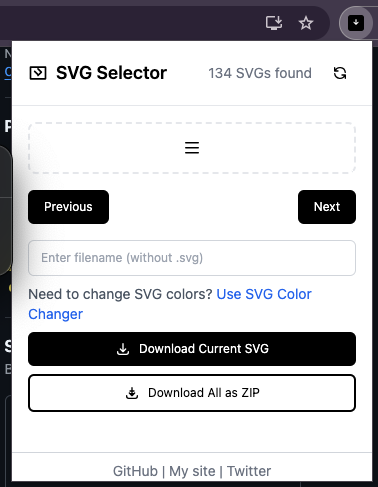

# SVG Downloader & Extractor Chrome Extension

A Chrome extension that allows you to easily extract and download SVG images from any website. Perfect for designers and developers who need to save vector graphics, icons, or logos in their original SVG format.

## Features

- 🔍 Automatically detects all SVG elements on the current page
- 💾 Download individual SVGs with custom filenames
- 📦 Bulk download all SVGs as a ZIP file
- 🎨 Direct link to SVG color changer tool
- 🖼️ Works with both inline SVGs and SVG image files
- 🚀 Simple and intuitive interface

## Installation

1. Download or clone this repository
2. Open Chrome and go to `chrome://extensions/`
3. Enable "Developer mode" in the top right corner
4. Click "Load unpacked" and select the `extension` folder

## Usage

1. Click the extension icon on any webpage
2. Browse through detected SVGs using Previous/Next buttons
3. Optional: Enter a custom filename
4. Click "Download Current SVG" or "Download All as ZIP"

## Screenshots

## Contributing

Feel free to open issues or submit pull requests if you have suggestions for improvements.

## License

MIT License - see the [LICENSE](LICENSE) file for details.

## Author

- [Flozad](https://github.com/Flozad)
- Website: [clasicwebtools.com](https://clasicwebtools.com)
- Twitter: [@lozards](https://twitter.com/lozards)

## Support

If you find this extension useful, consider:
- ⭐ Starring the repository
- 🐛 Reporting any bugs you find
- 💡 Suggesting new features
- 🔄 Sharing it with others 