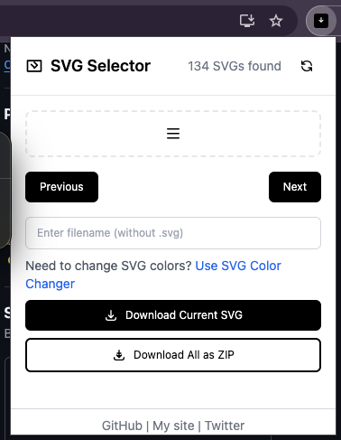

# SVG Web Downloader & Extractor


A Chrome extension that finds every SVG on a page and lets you download them — individually or all at once as a ZIP. Built for designers and developers who need to grab vector graphics, icons, or logos in their original format.

[**Website**](https://svg.clasicwebtools.com) · [Report a bug](https://github.com/Flozad/svg-downloader/issues) · [Security policy](SECURITY.md)



## Features

- 🔍 Finds inline `<svg>`, `` SVGs, CSS backgrounds, and `<object>`/`<embed>`/`<iframe>` hosts
- 🎨 Resolves `currentColor` and CSS variables, so extracted icons look like they did on the page
- 🧩 Inlines `<use>` sprite references, so you don't get an empty husk
- 💾 Download individual SVGs with a custom filename
- 📦 Bulk download everything as a ZIP
- 🔒 No tracking, no analytics, no host permissions

## Install

From the Chrome Web Store — or load it from source:

1. `git clone https://github.com/Flozad/svg-downloader.git`
2. Open `chrome://extensions/`
3. Enable **Developer mode** (top right)
4. **Load unpacked** → select the `extension/` folder

There is no build step. The source in `extension/` is exactly what ships.

## Usage

1. Click the extension icon on any webpage
2. Page through the detected SVGs with Previous/Next
3. Optionally type a filename
4. **Download Current SVG**, or **Download All as ZIP**

Filename prefix, ZIP name, and scan-on-open can be changed in the extension's options page.

## Permissions

The extension requests four permissions and no host permissions at all:

| Permission | Why |
| --- | --- |
| `activeTab` | Read the current page — only after you click the icon, and only until you navigate away |
| `scripting` | Inject the content script that finds the SVGs |
| `downloads` | Save the files you asked for |
| `storage` | Remember your options-page preferences |

There is no `<all_urls>`, no background service worker, and no network access beyond the page you're actively on. See [SECURITY.md](SECURITY.md) for the full threat model.

## Development

Requires [Bun](https://bun.sh).

```bash
bun install
bun run test     # vitest
bun run lint     # biome
bun run package  # build the Web Store zip into dist/
```

### Project layout

| Path | What it is |
| --- | --- |
| `extension/` | The extension itself — plain ESM, no bundler |
| `test/` | Vitest suite (jsdom) |
| `scripts/` | `package.sh`, which builds the Web Store zip |
| `docs/` | The marketing site, deployed to svg.clasicwebtools.com |
| `motion/` | Optional [Remotion](https://remotion.dev) project that renders the promo videos — not needed to work on the extension |
| `store-assets/` | Screenshots and promo art for the Web Store listing |

See [CONTRIBUTING.md](CONTRIBUTING.md) before opening a pull request — especially the notes on why untrusted SVG never becomes live markup.

## License

[MIT](LICENSE).

The bundled fonts are third-party and licensed separately under the SIL Open Font License — see [`extension/fonts/README.md`](extension/fonts/README.md). [JSZip](https://stuk.github.io/jszip/) is vendored under MIT.

## Author

- [Flozad](https://github.com/Flozad)
- Website: [clasicwebtools.com](https://clasicwebtools.com)
- Twitter: [@lozards](https://twitter.com/lozards)

## Support

If you find this useful — star the repo, report bugs you hit, or suggest features. All appreciated.
